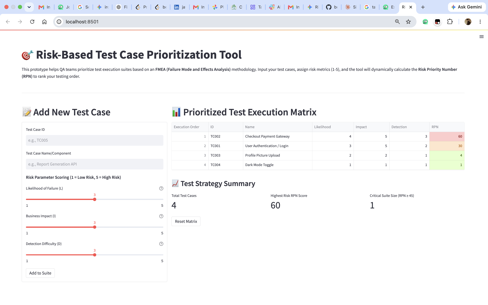

# 🎯 Risk-Based Test Case Prioritization Tool

An interactive web-based prototype that helps QA engineering teams prioritize test execution using a **Failure Mode and Effects Analysis (FMEA)** risk assessment methodology.

The application identifies high-risk, business-critical test cases so they can be executed first, helping teams maximize testing effectiveness when release timelines are limited.

---

# 🧠 Methodology

Each test case is evaluated using three risk factors on a scale of **1 (Low)** to **5 (High)**.

| Parameter                     | Description                                                                                                   |
| ----------------------------- | ------------------------------------------------------------------------------------------------------------- |
| **Likelihood of Failure (L)** | The probability that the feature contains defects (for example, recently modified code or legacy components). |
| **Business Impact (I)**       | The severity of customer or business impact if the feature fails.                                             |
| **Detection Difficulty (D)**  | How difficult it would be to detect the defect during normal testing or production usage.                     |

## Risk Priority Number (RPN)

Each test case receives a **Risk Priority Number (RPN)** using the following formula:

```text
RPN = L × I × D
```

The application automatically sorts test cases in **descending order** based on their RPN.

If two test cases have the same RPN, the one with the higher **Business Impact** score is prioritized first.

---

# ✨ Features

* Interactive FMEA risk assessment inputs
* Adjustable sliders for all three risk parameters
* Automatic Risk Priority Number (RPN) calculation
* Dynamic prioritization of test cases
* Conditional color highlighting:

  * 🔴 High Risk (RPN ≥ 45)
  * 🟠 Medium Risk
  * 🟢 Low Risk
* Executive dashboard with:

  * Total test cases
  * Highest RPN values
  * High-priority test suite summary

---

# 🛠 Prerequisites

* Python 3.8–3.11
* macOS, Windows, or Linux

---

# 🚀 Installation

## 1. Clone the Repository

```bash
git clone <your-repository-url>
cd risk-prioritization-tool
```

---

## 2. Create a Virtual Environment

```bash
python3 -m venv venv
```

### Activate the Virtual Environment

**macOS / Linux**

```bash
source venv/bin/activate
```

**Windows**

```bash
.\venv\Scripts\activate
```

---

## 3. Install Dependencies

```bash
pip install -r requirements.txt
```

> **Note:** If you encounter an OpenSSL compatibility issue related to `urllib3` in older environments, install an earlier version using:
>
> ```bash
> pip install "urllib3<2.0"
> ```

---

## 4. Run the Application

Start the Streamlit application:

```bash
streamlit run app.py
```

The application will automatically open in your default web browser at:

```text
http://localhost:8501
```

---

# 📊 How It Works

1. Enter or select test cases.
2. Assign values for:

   * Likelihood of Failure (L)
   * Business Impact (I)
   * Detection Difficulty (D)
3. The application calculates the **Risk Priority Number (RPN)** for each test case.
4. Test cases are automatically ranked from highest to lowest priority.
5. Use the dashboard to identify the most critical areas that should be tested first.

---

# 🧪 Technologies Used

* Python
* Streamlit
* Pandas

---


# 📸 Sample Output

The screenshot below demonstrates the application after prioritizing test cases based on their calculated Risk Priority Numbers (RPN).



# 📄 License

This project is intended for educational and demonstration purposes.
